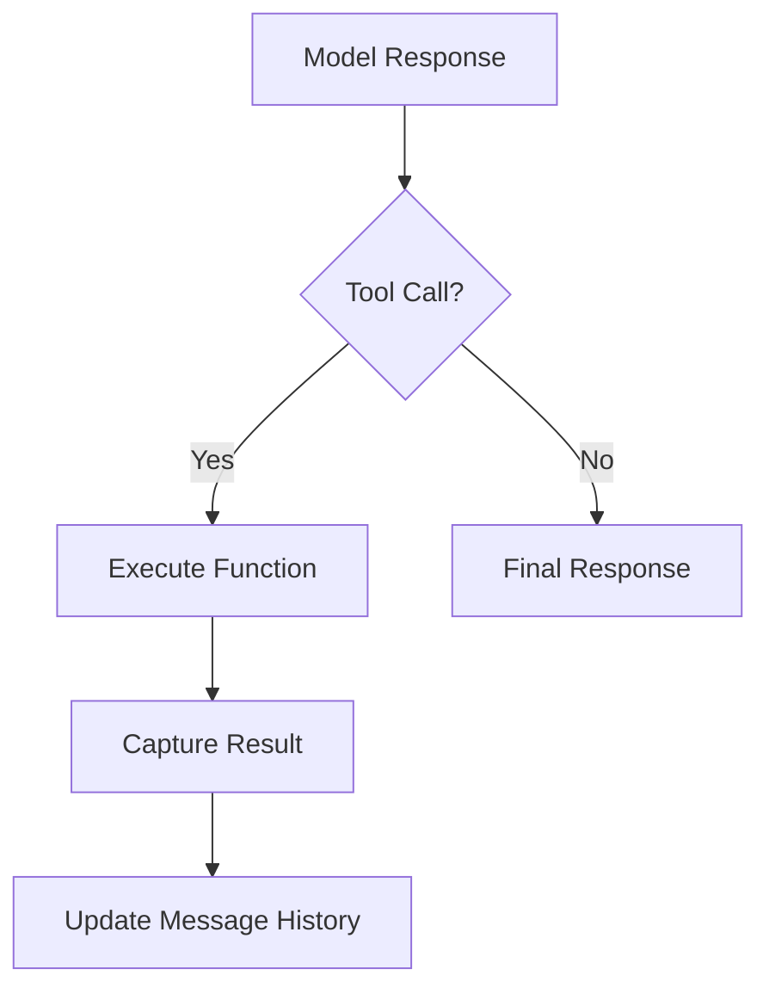

# Course Design for `basic_agent.py`

**Unit2 Objectives:**
1. Implement agent pattern with multiple functional tools
2. Maintain message history across agent interactions
3. Handle complex JSON structures for function definitions
4. Create error handling for system calls
5. Build self-repairing tool execution flows

## Code Explanation

1. **System Message**:
- Contains explicit documentation rules
- Specifies JSON structure preservation requirements
- Defines folder naming conventions:
  ```json
  ./Unit1-basic_chatcompletion/
  ./Unit2-basic_agent/
  ```

2. **Tool Definitions**:
- All functions use strict JSON format:
  ```python
  {
    "type":"function",
    "function": {
      "name":"list_dir",
      "parameters": { ... }
    }
  }
  ```
- Key functions: `list_dir`, `read_file`, `write_file`, `mkdir`

3. **Execution Engine**:
- Main loop: `while not_done` with:
  - Message history tracking
  - Function call execution
  - Error handling with try/catch
- State preserved in `messages[]` array with:
  ```python
  messages.append(message)
  messages.append(tool_result)
  ```

4. **Core Functions**:
- `tools_by_name = {
  "list_dir": list_dir,
  "read_file": read_file,
  ...}
- Each function:
  - Uses strict file path parameters
  - Returns structured results
  - Maintains JSON integrity

## Flowchart


## Error Handling
Automatic error tracking with:
```python
messages.append({
  "role": "tool",
  "content": "Your function call returned an error: " + str(e)
})
```