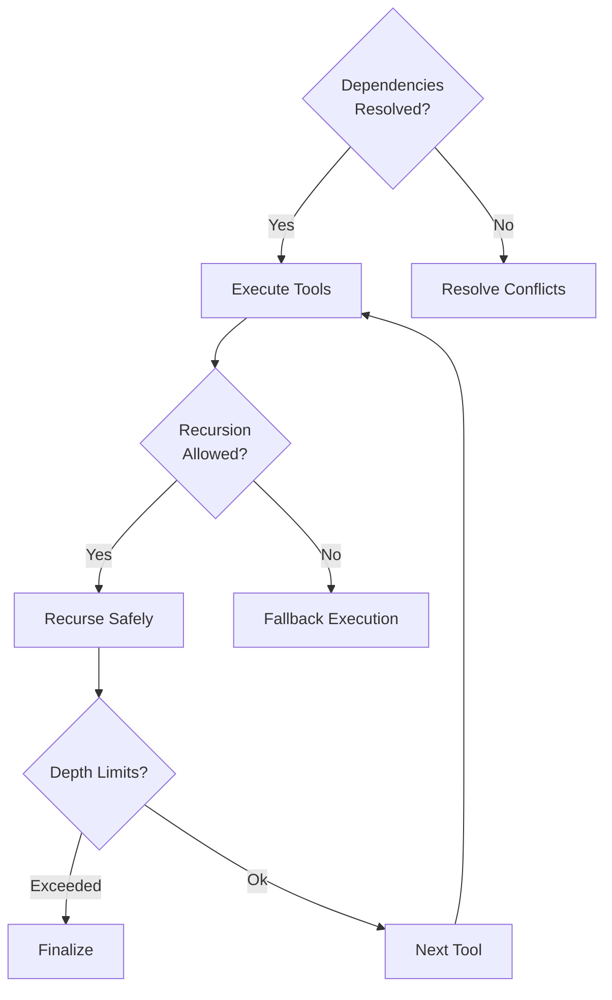

# Course Design for Advanced Agent Patterns (Unit3)

**Unit3 Objectives:**
1. Implement dependency resolution between tools
2. Manage recursive execution with safety limits
3. Add version control for agent patterns
4. Create topological sort dependency tracking

## Code Explanation

### 1. Tool Dependency Management
```python
class ToolChain:
    """Manages agent tool dependencies"""
    
    def __init__(self):
        self.tools = {
            "dependency_resolver": resolve_dependencies,
            "state_validator": validate_state,
            "recursive_executor": recursive_execute
        }
```
  
  Key Features:
  - Tool registry with dependency awareness
  - Automatic execution ordering via topological sort
  - Graph-based dependency resolution

### 2. Topological Sort Algorithm
```python
def _topological_sort(self, graph):
    """Kahn's algorithm for topological sorting"""
    in_degree = {u: 0 for u in graph}
    adjacents = {u: [] for u in graph}
    
    for u in graph:
        for v in graph[u]:
            adjacents[u].append(v)
            in_degree[v] += 1
    
    queue = [u for u in in_degree if in_degree[u] == 0]
    ordered = []
    
    while queue:
        u = queue.pop(0)
        ordered.append(u)
        
        for v in adjacents[u]:
            in_degree[v] -= 1
            if in_degree[v] == 0:
                queue.append(v)
    
    if len(ordered) != len(graph):
        raise ValueError("Cycle detected in dependencies")
```
  
  Visualization:
  ```mermaid
  graph TD
    A[Tool A] --> B[Tool B]
    A --> C[Tool C]
    B --> D[Tool D]
    C --> D
    D --> E[Execution]
  
    classDef dependency stroke:#000000,fill:#f2f2f2;
    classDef required stroke:#ff3333,fill:#ffffff;
  
    class A,B,C,D,E dependency
  
    B -->|requires| A
    D -->|requires| C
  
```

### 3. Recursive Execution Safety
```python
def recursive_execute(context):
    """Manages recursive execution with tracking"""
    context['step'] = context.get('step', 0) + 1
    
    if context['step'] >= MAX_RECURSION_DEPTH:
        raise StateError("Recursion depth limit reached")
    
    # Save current state for rollback:
    execution_log.append(copy_state(context))
    
    return execute_tool(context['tool_chain'][0], context)
```
  
  Safety Features:
  - Hard depth limits with fallback execution
  - State logging for rollbacks
  - Context history tracking

### 4. Agent Versioning System
```python
class AgentVersionControl:
    """Tracks pattern versions and migrations"""
    
    def __init__(self):
        self.patterns = {
            "1.0": basic_patterns,
            "2.0": recursive_patterns
        }
```
```json
// Version 2.0 Pattern Definition
{
  "name": "recursive_agent",
  "version": "2.0",
  "pattern": {
    "execute": "recursive_execute",
    "validate": "validate_state",
    "dependencies": [
      "dependency_resolver",
      "state_validator"
    ]
  }
}
```
  
  Migration Flow:
  ```mermaid
  sequenceDiagram
    participant VC as VersionControl
    participant Agent
    participant Migrator
    
    VC->>Agent: CheckCurrentVersion
    Agent-->>VC: v1.0
    VC->>Migrator: Apply Upgrade 1.0→2.0
    Migrator-->>VC: Migration complete
    VC->>Agent: Set version=2.0
  
```

## State Flow Diagram


## Test Patterns
```python
import pytest

from advanced_agent_patterns import ToolChain, recursive_execute


def test_topological_sort():
    graph = {
        "A": ["B", "C"],
        "B": ["D"],
        "C": ["D"],
        "D": []
    }
    
    chain = ToolChain()
    ordered = chain._topological_sort(graph)
    assert ordered == ['D', 'C', 'B', 'A']


def test_recursion_limit():
    context = {
        "step": MAX_RECURSION_DEPTH - 1
    }
    assert not recursive_execute(context)
```
