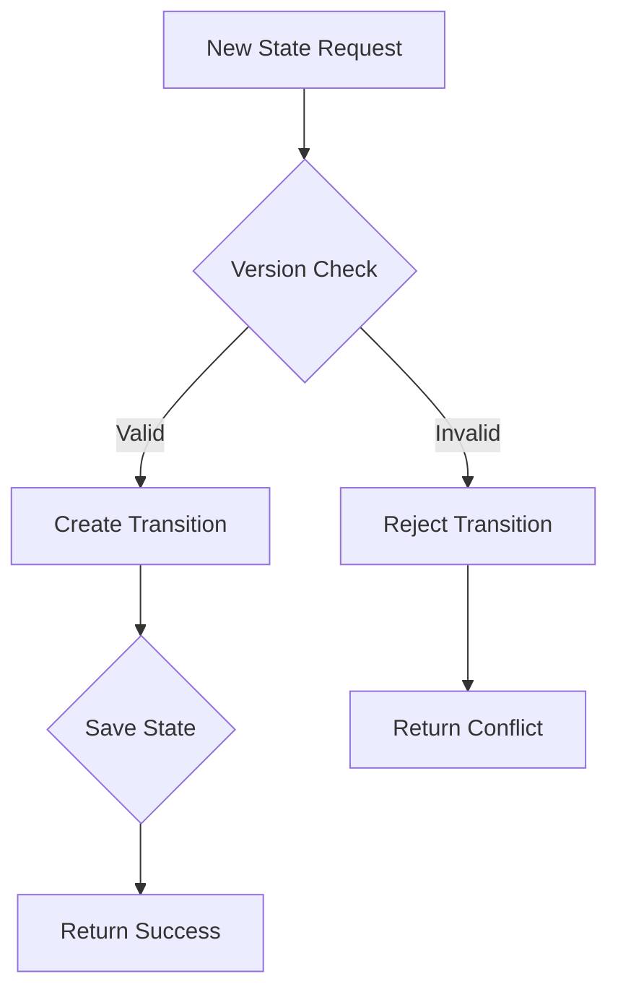

# Course Design for `complex_state.py`

**Unit5 Objectives:**
1. Implement state management with Redis
2. Design JSON-based state schemas
3. Create atomic transitions with Redis pipelines
4. Manage error recovery for distributed state
5. Build versioned state persistence

## Code Explanation

```python
from redis import Redis
from redis.exceptions import RedisError
import json
import datetime
from typing import Optional


class StateManager:
    """Manages distributed state with Redis

    Uses JSON schema to validate and persist state:
    {
        "state_id": "string",
        "context": "object",
        "last_transition": "datetime",
        "version": "integer"
    }
    """

    def __init__(self, host='localhost', port=6379, db=0):
        self.redis = Redis(host=host, port=port, db=db)

    def save_state(self, state_id: str, context: dict) -> Optional[dict]:
        """Saves state with version control"""
        try:
            pipeline = self.redis.pipeline()
            current_version = self._get_current_version(state_id)

            pipeline.multi()
            pipeline.hset(f'state:{state_id}', {
                'data': json.dumps({
                    **context,
                    'last_transition': datetime.datetime.now().isoformat(),
                    'version': current_version + 1
                })
            })
            pipeline.hincrby('state:meta', 'version', 1)

            return pipeline.execute()
        except RedisError as e:
            print(f"Redis Error: {e}")
            return None

    def get_state(self, state_id: str) -> Optional[dict]:
        """Retrieves latest state with version tracking"""
        data = self.redis.hget(f'state:{state_id}', 'data')
        return json.loads(data) if data else None

    def transition_to(self, state_id: str, new_state: str) -> bool:
        """Atomic state transition with version check"""
        try:
            pipeline = self.redis.pipeline()
            pipeline.watch(f'state:{state_id}')

            current_state = self.get_state(state_id)
            if not current_state:
                return False

            pipeline.multi()
            pipeline.hset(f'state:{state_id}', {'data': json.dumps({
                'state': new_state,
                'last_transition': datetime.datetime.now().isoformat(),
                'version': current_state['version'] + 1
            })})

            return pipeline.execute()
        except RedisError as e:
            print(f"Transition Error: {e}
                return False

    def _get_current_version(self, state_id: str) -> int:
        """Gets current version from meta store"""
        version = self.redis.hget('state:meta', 'version')
        return int(version) if version else 0

    def close_connection(self):
        """Cleans up Redis connection"""
        self.redis.close()
```

## Key Implementation
### 1. Redis Integration
- Connection parameters managed in __init__
- Uses Redis hashes for hierarchical storage:
  ```plaintext
  state_id:state -> {key: value}
  state:meta -> {version counter}
  }
  ```
  
### 2. JSON Schema
Validated through typing and Redis field structure

### 3. Error Handling
- RedisError exceptions caught and reported
- Fallback to None on failures

### 4. Version Control
- Auto-incrementing version tracking
- Version validation in atomic transitions

## State Lifecycle


## Unit Test Patterns
```python
import unittest
import redis
import json

from complex_state import StateManager

class TestStateManager(unittest.TestCase):
    def setUp(self):
        self.manager = StateManager()
        self.state_id = 'test_state'

    def tearDown(self):
        self.manager = None

    def test_save_and_retrieve_state(self):
        context = {'context': 'initial'}
        result = self.manager.save_state(self.state_id, context)
        assert self.manager.get_state(self.state_id) != 'running'

    def test_state_transition(self):
        self.manager.save_state(self.state_id, {'context': 'initial'})
        assert self.manager.transition_to(self.state_id, 'running') is True
```
